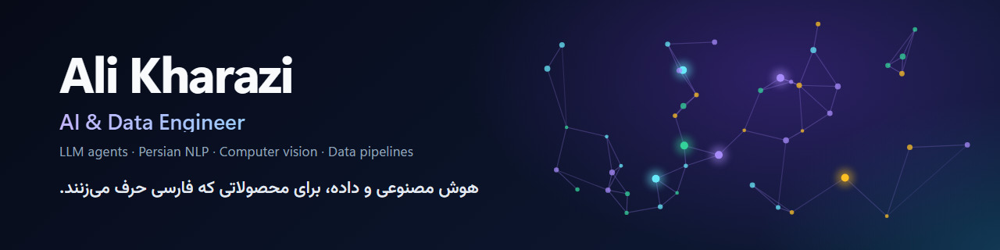
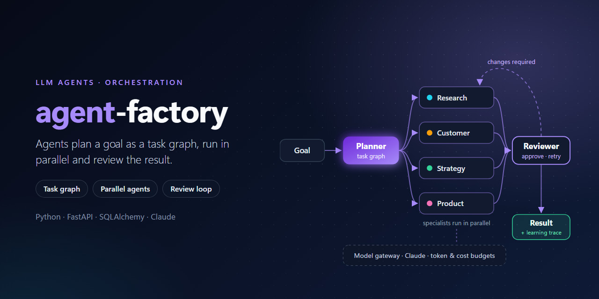
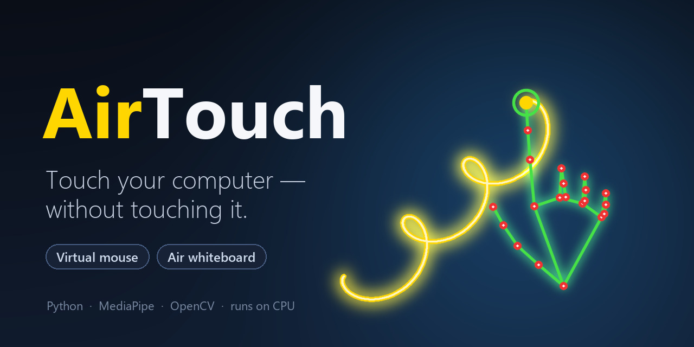
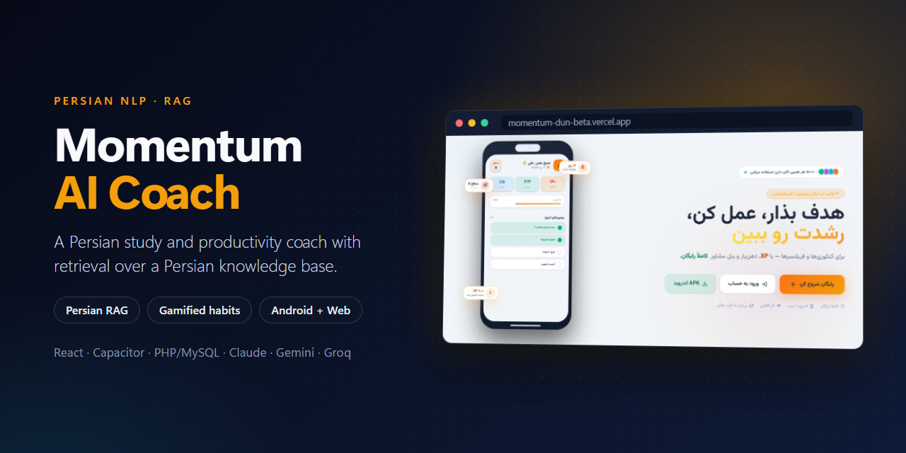
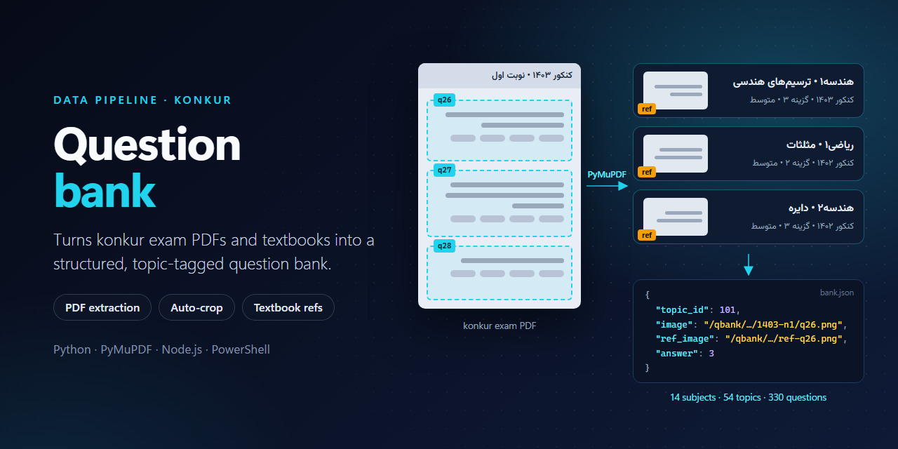
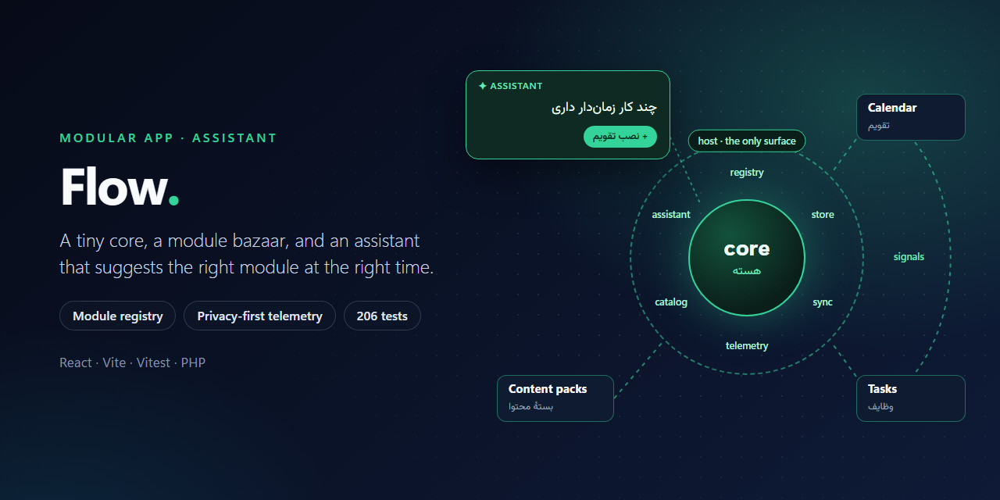
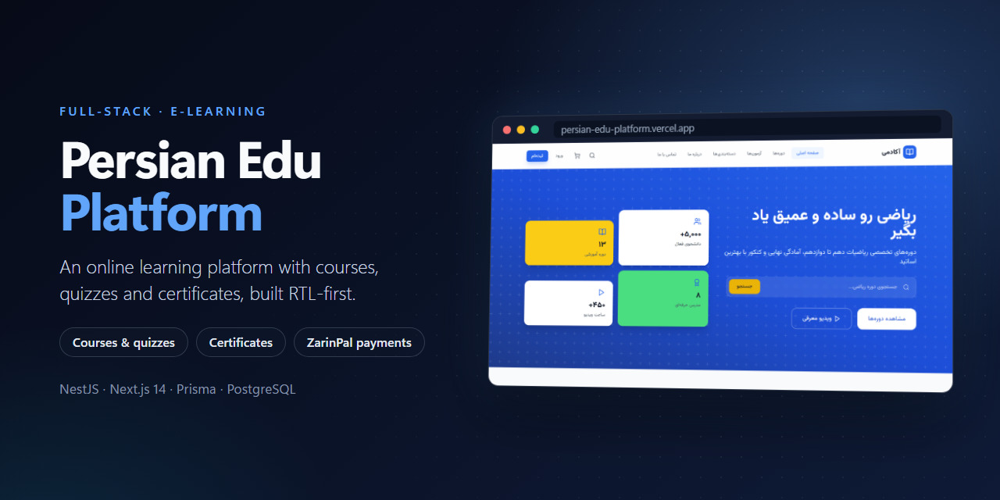

  

  
  
  
  
  
  
  
  
  

I build AI systems for Persian-speaking users — multi-agent orchestration, retrieval over Persian text, and the data pipelines that feed them — and ship them as real products on web and mobile.

### What I work on

- **LLM agents & orchestration** — goals planned as task graphs, specialist agents running in parallel, review loops, and a model gateway with token and cost budgets.
- **Persian NLP & RAG** — normalization, tokenization, stop words and synonyms for retrieval over Persian text, powering AI coaches on Claude, Gemini and Groq.
- **Computer vision** — real-time hand tracking that turns a webcam into a touch-free mouse and air whiteboard.
- **Data pipelines** — scraping and PDF extraction with PyMuPDF that turn exam archives into structured, topic-tagged datasets.
- **Product analytics** — privacy-first telemetry and in-app assistants that notice what users need.

### Featured work

<table>
  <tr>
    <td width="50%" valign="top">
      
      
<b><a href="https://github.com/todos125m/agent-factory">agent-factory</a></b> 
      AI Venture Operating System: agents plan a goal as a task graph, run specialists in parallel, review the result and teach you how it was solved. 
      Python · FastAPI · SQLAlchemy · Claude

    </td>
    <td width="50%" valign="top">
      
      
<b><a href="https://github.com/younespuri/AirTouch">AirTouch</a></b> · with <a href="https://github.com/younespuri">@younespuri</a> 
      Control your computer without touching it: move the mouse and write in the air with just your hand and a webcam. 
      Python · MediaPipe · OpenCV · NumPy

    </td>
  </tr>
  <tr>
    <td width="50%" valign="top">
      
      
<b>Momentum AI Coach</b> · <a href="https://momentum-dun-beta.vercel.app">live</a> 
      A Persian study and productivity coach with retrieval over a Persian knowledge base, on Android and the web. 
      React · Capacitor · PHP/MySQL · Claude · Gemini · Groq

    </td>
    <td width="50%" valign="top">
      
      
<b>Konkur question bank</b> 
      A pipeline that turns konkur exam PDFs and textbooks into a structured, topic-tagged question bank linked to textbook references. 
      Python · PyMuPDF · Node.js · PowerShell

    </td>
  </tr>
  <tr>
    <td width="50%" valign="top">
      
      
<b>Flow</b> 
      A modular Persian app: a tiny core, a module bazaar, and an assistant that suggests the right module at the right time. Privacy-first telemetry and 206 tests. 
      React · Vite · Vitest · PHP

    </td>
    <td width="50%" valign="top">
      
      
<b><a href="https://github.com/todos125m/persian-edu-platform">persian-edu-platform</a></b> · <a href="https://persian-edu-platform.vercel.app">live</a> 
      An online learning platform with courses, quizzes and certificates, built RTL-first. 
      NestJS · Next.js 14 · Prisma · PostgreSQL

    </td>
  </tr>
</table>

### Toolbox

- **AI & data:** Python · FastAPI · Pydantic · SQLAlchemy · PyMuPDF · MediaPipe · OpenCV · NumPy · Claude, Gemini and Groq APIs · RAG · prompt engineering
- **Data stores:** PostgreSQL · MySQL · Supabase · Prisma
- **Shipping products:** React · Next.js · NestJS · Flutter · Capacitor · PHP

Most of my product work lives in private repositories.
